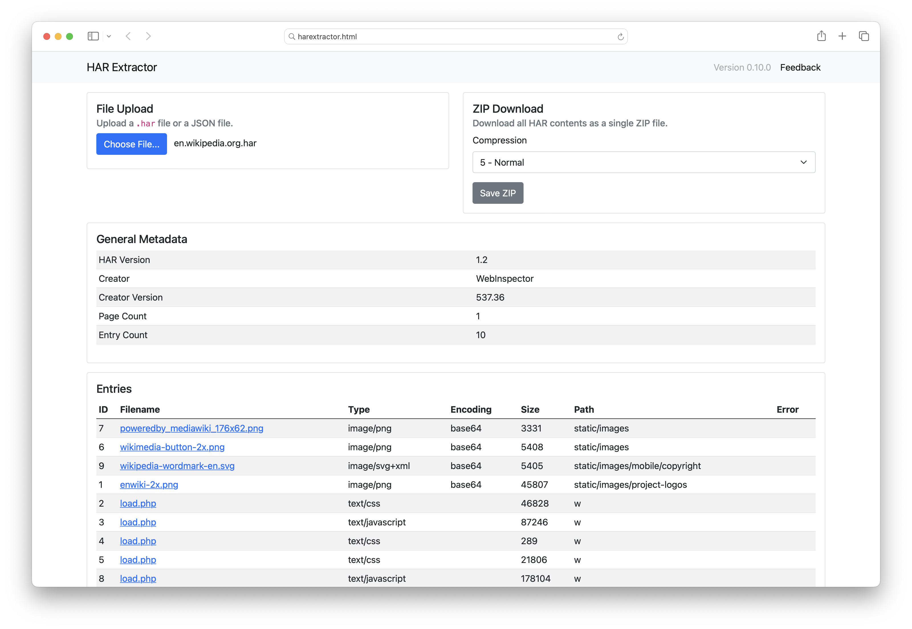

# HAR Extractor

A Browser-based HAR extraction tool.

~~You can use it online if you don't
want to download it.~~ There is currently no hosted version of this fork.

All you need is `harextractor.html` -- it's mostly completely self-contained. Open the page in a browser and use the file chooser button on the page to load a HAR
file. From there you can save individual files, and also save the entire collection as a ZIP
file:

It is extremely basic right now but may evolve over time.

## Fork

This tool is a fork of [harextract](https://github.com/JC3/harextract) by [Jason C (JC3)](https://github.com/JC3). It includes some changes from the original:

* Use Bootstrap 5 for design and layout.
* Display all entries in a single table instead of two tables for exportable
  and not exportable entries.
* Export all entries in the ZIP file. Previously only Base64 encoded files were exported.
* Disable the update check.
* Use CDNs for Bootstrap and JSZip.

## Bugs

Probably a ton. Written quickly and only tested on Chrome for Windows. Report them on
the issues page.

## License

This project is open source licensed under the GPL-3.0 license. Please see the [LICENSE file](LICENSE) for more information.
